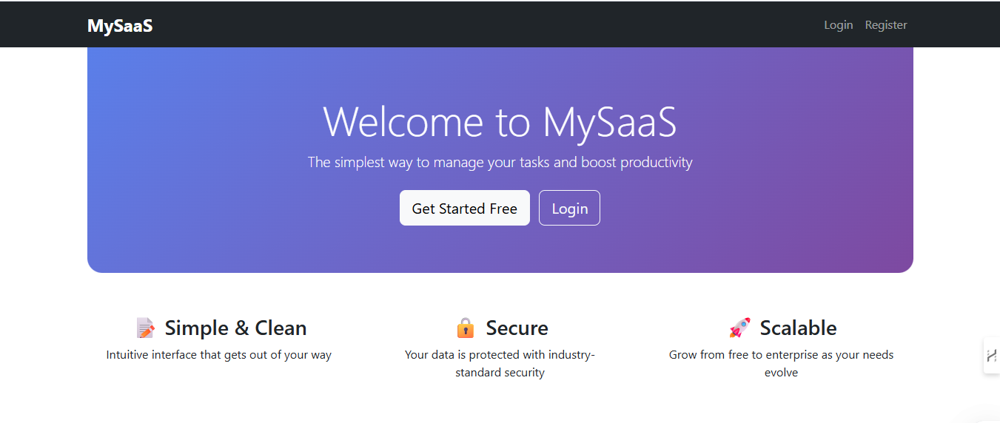

# My SaaS Todo App 🚀

A simple **Software-as-a-Service (SaaS)** application built with **Python, Flask, and PostgreSQL**.  
Users can register, log in, manage todos, and choose between **Free, Pro, or Enterprise** subscription plans.



## ✨ Features

- ✅ User registration & secure login (with password hashing)
- ✅ Todo management (add, complete, delete)
- ✅ Subscription tiers (Free / Pro / Enterprise)
- ✅ Responsive Bootstrap 5 UI
- ✅ PostgreSQL database
- ✅ Deployed on Render (free hosting)

## 🚀 Live Demo

👉 [View Live App](https://my-saas-app-2pxi.onrender.com)

> Replace the URL above with your actual Render URL!

## 🛠️ Tech Stack

- **Backend**: Python, Flask
- **Database**: PostgreSQL (via Render)
- **Authentication**: Flask-Login
- **Frontend**: HTML, Bootstrap 5
- **Hosting**: [Render](https://render.com)

## 📦 Requirements

- Python 3.8+
- pip

## 🚀 Local Setup

1. Clone the repository:
   ```bash
   git clone https://github.com/kumar4425/my-saas-app.git
   cd my-saas-app